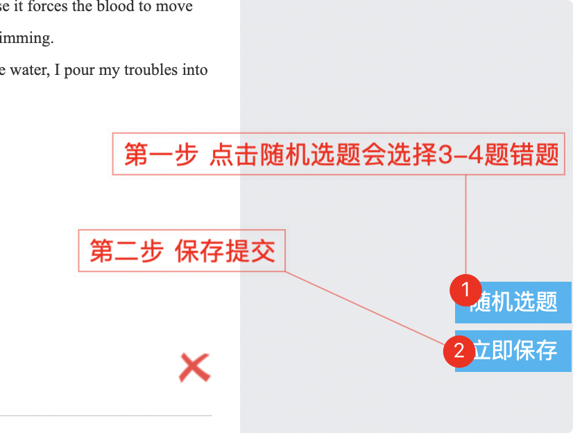
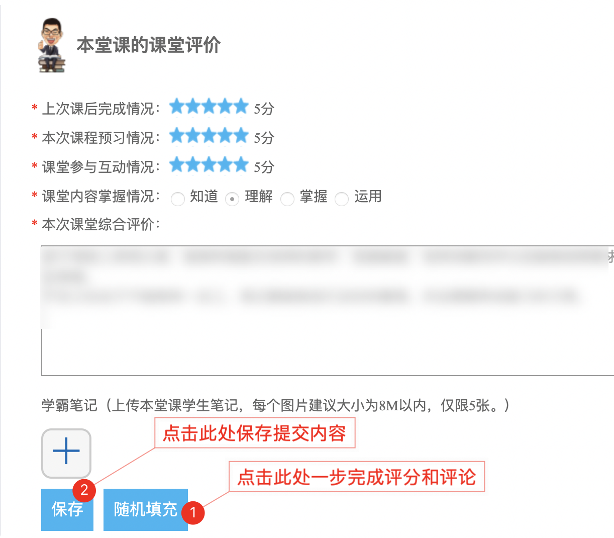

# 精锐评课辅助插件

### 安装步骤

+ 下载安装包 `https://github.com/taoes/onesmart_lesson_comment/archive/master.zip`
+ 解压安装包到指定位置，如D盘

+ 在Chrome浏览器地址栏目输入 ： `chrome://extensions/`
+ 开启右上角的开发者模式
+ 点击左侧 `加载已解压的拓展程序`即可

## 插件安装教程

+ 
+ 在Chrome浏览器中的地址栏输入 `chrome://extensions/` 打开Chrome的拓展程序界面
+ 在右上角开启开发者模式
+ 点击左侧加载已解压的拓展程序，选择之前解压好的文件夹目录即可
+ Chrome 的任务栏中出现 插件图标表示已经启用成功  

## 界面截图

#### 1v1 评课

#### 随机选择错题

#### 汇总评分

> 本辅助插件是写给我女朋友使用的

